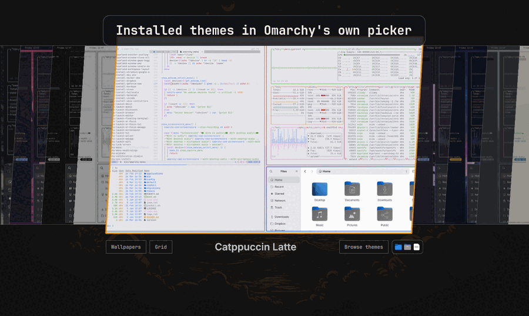

# Omarchy Theme Manager

<p align="center">
  
</p>

<p align="center">
  <picture>
    <source srcset="assets/banner.webp" type="image/webp" />
    
  </picture>
</p>

<p align="center">
  Themes, sticky wallpapers/icons, and Wallhaven browsing inside Omarchy's native
  full-screen picker — one replacement for <code>omarchy.image-picker</code>.
</p>

## Features

- **Sticky per-theme memory** — wallpaper and icon overrides persist in
  `~/.config/omarchy/theme-manager-memory.json` and restore after theme switches
  (including native `omarchy-theme-set`).
- **Icons mode** — `Ctrl+I` opens a live-preview grid of installed icon themes;
  the footer Icons chip shows three previews for the _highlighted_ theme
  (sticky memory or package default).
- **Themes ⇄ Wallpapers cross-nav** — jump with footer chips or `Ctrl+T` /
  `Ctrl+W`; **Browse** stays on the right next to Icons.
- **Theme catalog** — filters (listing / availability / sort / min stars),
  fuzzy search, source-review links, and the official Omarchy badge.
- **Wallpaper picker** — favorites (`Ctrl+D`), live palette while browsing,
  Actions hamburger (Save / All / Reset / Remove), Wallhaven via Aether.
- **Wallhaven** — SFW search, filters, load-more; downloads install into the
  theme backgrounds folder so they appear in the local carousel.

## Requirements

- Omarchy 4.0 (Quattro)
- Aether 4.19+ for Wallhaven (optional; theme/wallpaper picker works without it)
- `curl`, `git`, `jq`, and GNU core utilities from a standard Omarchy install

## Install

```bash
omarchy plugin add https://github.com/mtolhuys/omarchy-theme-manager.git --enable
```

Update:

```bash
omarchy plugin update io.github.mtolhuys.theme-manager
```

The plugin declares `omarchy.clonedFrom: omarchy.image-picker`. Disabling or
removing it restores Omarchy’s built-in picker.

## Use

### Theme picker

Open the Omarchy theme switcher (`Super+Shift+Ctrl+Space`).

- Footer: **Wallpapers** on the left; **Browse themes** + Icons on the right.
- Type to search; arrows to navigate; `Enter` to install (with confirmation).
- Uninstall non-active themes with **Uninstall** / `Delete`.
- Catalog metadata caches for six hours — see [CATALOG.md](CATALOG.md).

### Wallpaper picker

Open the background switcher (`Super+Ctrl+Space`).

- Footer: Actions (☰) + **Themes** on the left; **Browse Wallhaven** + Icons on
  the right.
- Local favorites, live palette, Remove/Reset for user backgrounds.
- Wallhaven: type to search, **Filters** / `Ctrl+F`, **Load more** / `Ctrl+N`.

### Keyboard shortcuts

| Shortcut       | Action                                 |
| -------------- | -------------------------------------- |
| `Ctrl+T` / `T` | Themes (bare `T` when search inactive) |
| `Ctrl+W` / `W` | Wallpapers / leave Wallhaven           |
| `B` / `Ctrl+B` | Browse (themes catalog or Wallhaven)   |
| `M`            | Actions menu (local wallpapers)        |
| `Ctrl+I`       | Icons mode                             |
| `Ctrl+F`       | Filters (catalog or Wallhaven)         |
| `Ctrl+D`       | Toggle wallpaper favorite              |
| `Ctrl+Shift+D` | Favorites-only filter                  |
| `Ctrl+N`       | Load more Wallhaven results            |
| `Delete`       | Uninstall theme (theme picker)         |
| `Escape`       | Clear search / back / close            |

Bare letter shortcuts stay off while filter typing is active.

## Aether / Wallhaven

Wallhaven uses Aether instead of a second network client:

- `aether --wallhaven-thumbs` / `aether --wallhaven-download`
- Defaults match Aether: all categories, newest first, 1920x1080+, two pages
- Color filters use Wallhaven palette metadata (not brightness heuristics)

Theme browsing continues if Aether is missing; only Wallhaven requests surface
the Aether error. No Wallhaven API key is required for public SFW search.

## Security and privacy

Shell plugins run unsandboxed with the current user's permissions. Review
sources before enabling.

Themes: only normalized GitHub repository URLs; bounded catalog fields;
previews from strict GitHub allowlists. The mutable remote catalog is discovery
metadata only: Theme Manager never passes its entries to an installer. **Open
repository** takes you to GitHub so you can review the source and deliberately
choose whether to install it yourself. A catalog badge is not a security
endorsement.

Wallpapers: only Aether and Omarchy picker helpers; capped streaming output;
validated ids; previews from Aether's thumbnail cache; downloads from Aether's
wallpaper directory.

No install hooks; no elevated privileges.

## Development

```bash
npm run quality
```

Acceptance testing belongs in the disposable plugin lab:

```bash
cd ~/Projects/omarchy/plugin-lab
./bin/lab plugin ~/Projects/plugins/omarchy-theme-manager/tests/lab/acceptance.sh
./bin/lab plugin ~/Projects/plugins/omarchy-theme-manager/tests/lab/marketing-preview.sh
```

Read [UPSTREAM.md](UPSTREAM.md) before rebasing derived picker files.
See [CHANGELOG.md](CHANGELOG.md) for 0.5.x notes.

## Remove

```bash
omarchy plugin remove io.github.mtolhuys.theme-manager
```

Removing restores the built-in picker. Installed themes and downloaded
wallpapers stay. Delete `~/.config/omarchy/wallpaper-command-center.json` to
clear saved wallpaper favorites, and
`~/.config/omarchy/theme-manager-memory.json` for sticky memory.

## Credits

Wallpaper favorites, live palette previews, and carousel motion began as a
community contribution by [Fred Nix](https://github.com/nixfred).

## License

MIT. Picker code derived from Omarchy retains its upstream copyright notice in
[LICENSE](LICENSE).
